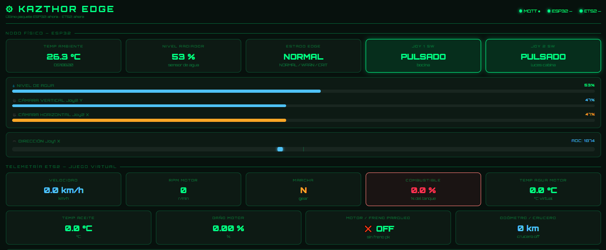
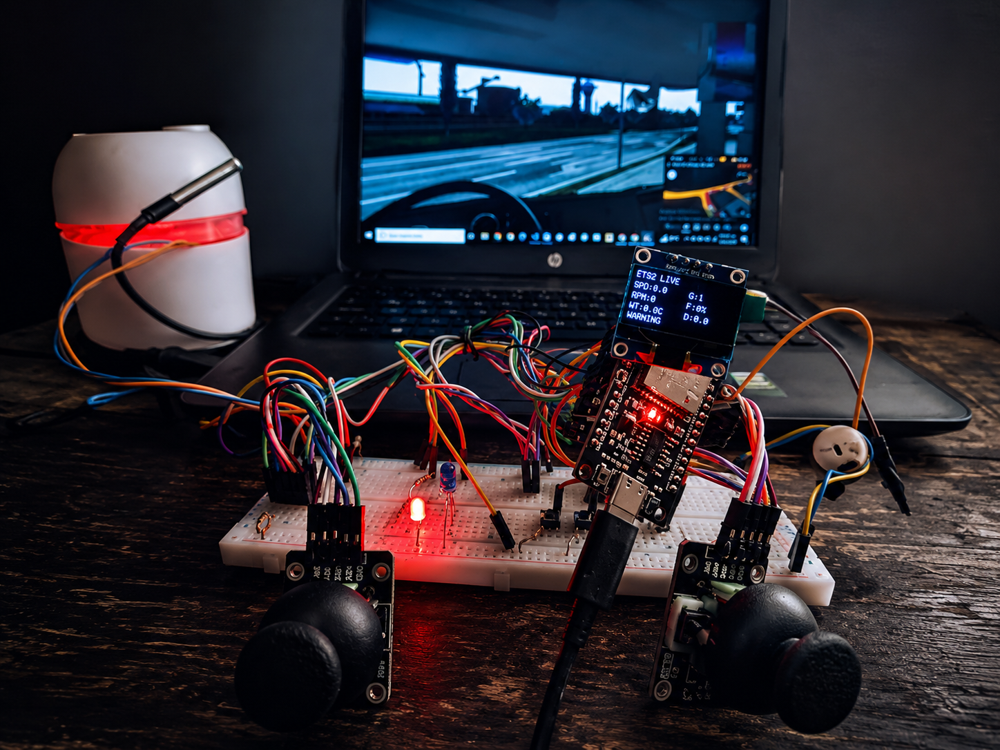
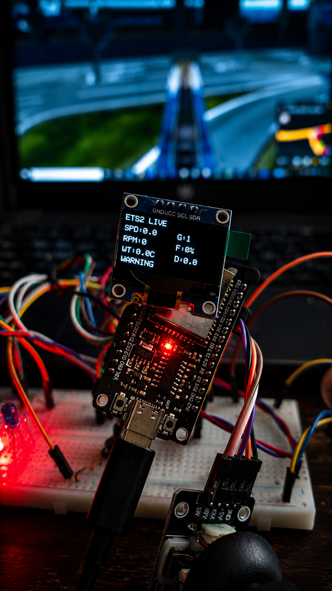
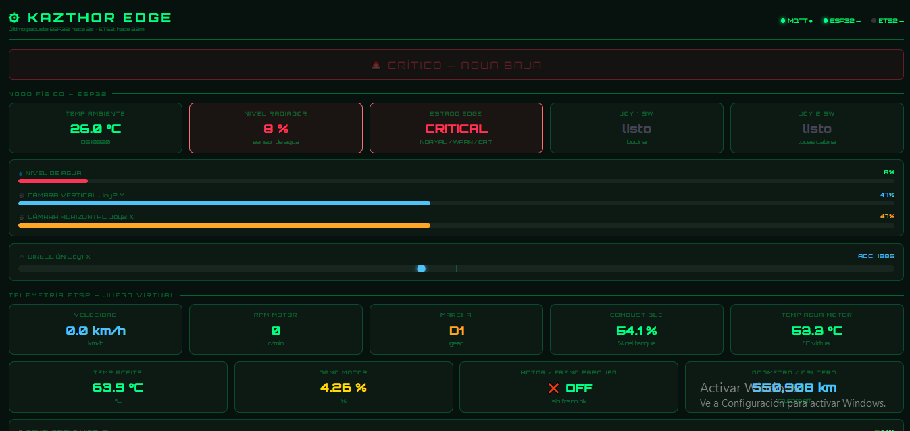
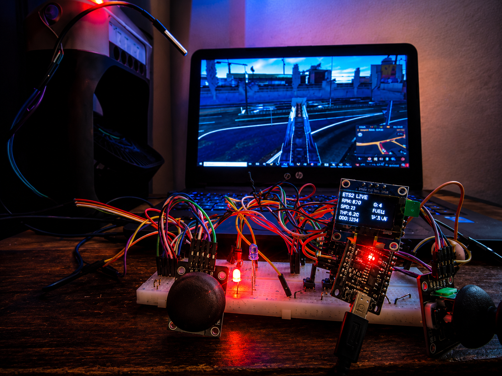
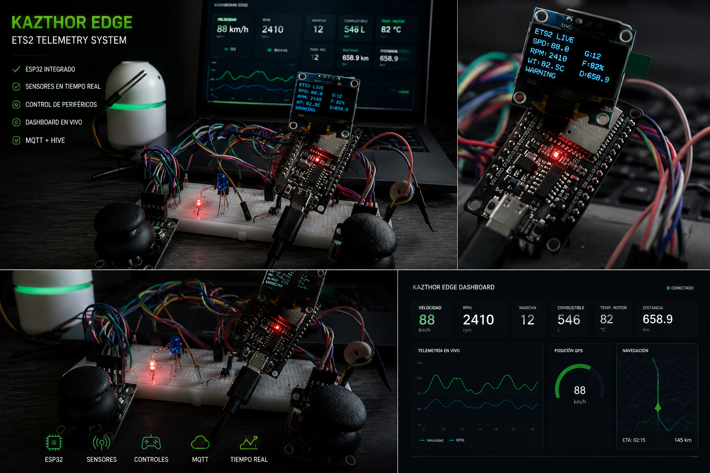

# KAZTHOR EDGE — ETS2 IoT Telemetry System

<p align="center">
  
</p>

<p align="center">


</p>

---

## 🚛 Overview

KAZTHOR EDGE is a real-time telemetry and physical simulator control system for Euro Truck Simulator 2 using ESP32, MQTT, OLED displays, joysticks and cloud dashboards.

The project combines:

* Real-time game telemetry
* Physical hardware controls
* OLED embedded displays
* MQTT cloud communication
* Edge + cloud hybrid architecture
* Real-world simulator interaction

---

## 🎮 Live Demo

<p align="center">
  
</p>

---

## ⚡ Features

| Feature             | Description                    |
| ------------------- | ------------------------------ |
| Real-Time Telemetry | Reads live ETS2 truck data     |
| ESP32 Dashboard     | Embedded telemetry display     |
| OLED Monitor        | Live truck information         |
| Physical Controls   | Dual joystick control system   |
| MQTT Cloud          | HiveMQ real-time communication |
| Alert System        | LEDs + buzzer warnings         |
| Hybrid Architecture | Local + cloud communication    |

---

## 🧠 System Architecture

```text
Euro Truck Simulator 2
        ↓
Telemetry SDK Server
        ↓
Python Bridge
        ↓
HiveMQ MQTT Broker
        ↓
ESP32 + OLED + Dashboard
```

---

## 🔧 Hardware Used

| Hardware       | Description                 |
| -------------- | --------------------------- |
| ESP32          | Main embedded controller    |
| OLED SSD1306   | Real-time telemetry display |
| Dual Joysticks | Truck controls              |
| Push Buttons   | Interaction controls        |
| LEDs           | Visual alerts               |
| Buzzer         | Audio alerts                |
| Breadboard     | Prototyping                 |
| Jumper Wires   | Connections                 |

---

## 📸 Gallery

### Embedded Setup

<p align="center">
  
</p>

### OLED Telemetry

<p align="center">
  
</p>

### Dashboard Interface

<p align="center">
  
</p>

<p align="center">
  
</p>

### Hardware Prototype

<p align="center">
  
</p>

<p align="center">
  
</p>

---

## 🚀 Future Plans

* ESP32-S3 USB HID support
* Farming Simulator integration
* Real plant telemetry system
* Smart greenhouse automation
* Multi-node IoT architecture
* Real-world digital twin systems

---

## 📡 Technologies

* ESP32
* Python
* MQTT
* HiveMQ
* OLED SSD1306
* HTML/CSS/JavaScript
* vJoy
* Euro Truck Simulator 2 SDK

---

## 📄 License

MIT License

---

## 👨‍💻 Author

Antonio Kazthor

GitHub:
https://github.com/antoniokazthor12345
